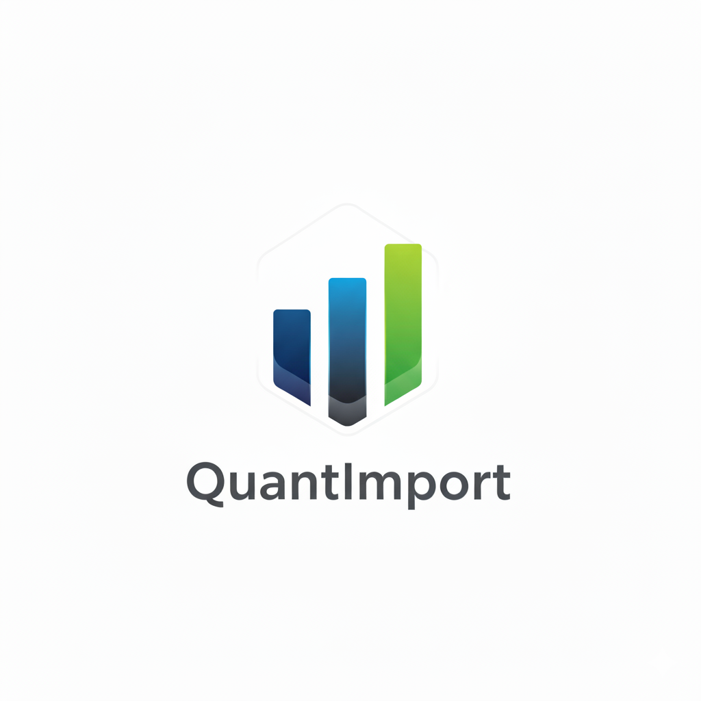

#  [QuantImport](https://quantimportbrazil.github.io/Sobre/)

---

Sou **André Coutinho Bueno**, Agrônomo com experiência no mercado de fertilizantes, e o Cientista de Dados por trás da **QuantImport**.

Na **QuantImport**, o **Aprendizado de Máquina (ML)** é aplicado para **quantificar e modelar os padrões de mercado** que *traders* e analistas internos buscam identificar. Nosso sistema processa e correlaciona as variáveis que influenciam a demanda para **substituir o esforço manual** de análise. Isso resulta em **projeções mais precisas** do que métodos estatísticos tradicionais, otimizando o processo de decisão e gerando **redução significativa de custos operacionais**.

---

## Estrutura do Modelo Preditivo

O foco da QuantImport é a **previsão da curva de importação de fertilizantes minerais** no Brasil.

O modelo é alimentado pela **integração de dados públicos e de mercado**, combinando a expertise em Agronomia com o processamento de Machine Learning.

**Fontes de Dados Incluídas:**

* **Comexstat (Governo Federal):** Séries históricas de importação (fertilizantes, agroquímicos, máquinas, diesel) e exportação de produtos agrícolas.
* **INMET (Governo Federal):** Dados de variáveis climáticas relevantes para o planejamento de safra (ex.: chuvas).
* **Dados de Mercado:** Coleta e processamento de *spot prices* internacionais de fertilizantes, variável fundamental que precede e influencia o volume da importação nacional.

A união dessas fontes e o **conhecimento de domínio** (Agronomia) resulta em projeções que **incorporam o contexto do mercado**. Essa arquitetura multivariada permite que o modelo se **autoajuste mais rapidamente a mudanças abruptas** (como *shocks* geopolíticos e de saúde pública), superando a lentidão de resposta de modelos baseados apenas na extrapolação de séries temporais históricas.

---

## Veja o Modelo em Ação

Transparência é fundamental. Veja a performance do nosso sistema e explore exemplos das projeções que entregamos:

* **Demonstração Interativa:** Análise da performance do modelo e projeções em tempo real. [**Acesse a Demo**](https://quantimportbrazil.github.io/Demo/)
* **Relatório de Exemplo (Projeção Total):** Projeção de Importação Total para os próximos 12 meses. [**Ver Exemplo 1**](*Insira o Link Direto para o Relatório 1 Aqui*)
* **Análise Setorial Detalhada:** Projeções por Tipo de Nutriente (N, P ou K). [**Ver Exemplo 2**](*Insira o Link Direto para o Relatório 2 Aqui*)

---

## Contato Direto

Se sua empresa busca transformar dados complexos em vantagem competitiva e otimizar o *supply chain*, entre em contato.

**André Coutinho Bueno**
Cientista de Dados e Fundador
E-mail: andre.bueno@quantimport.com.br
