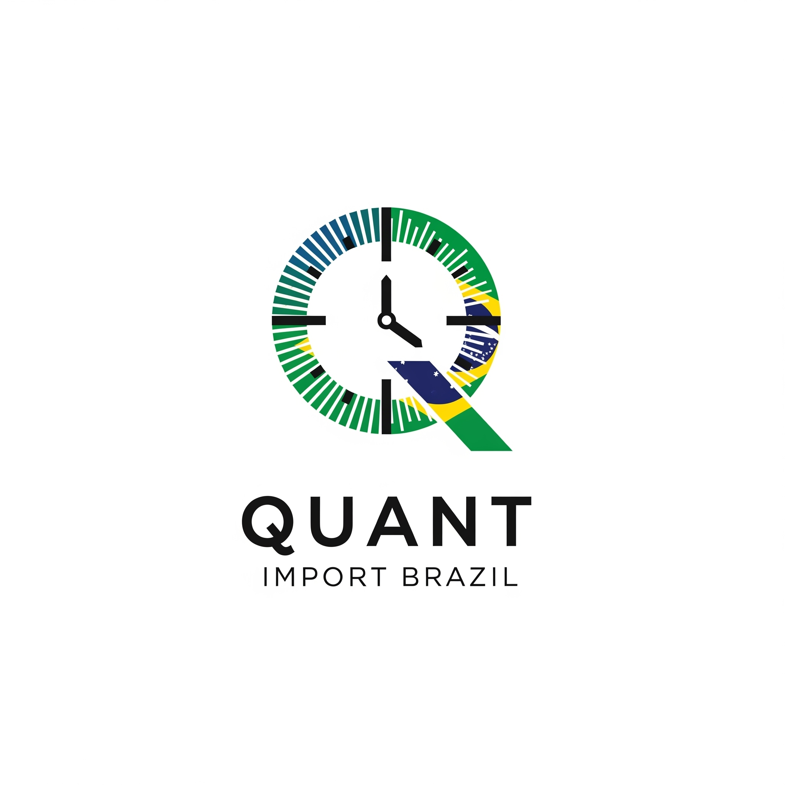

#  QuantImport  

---

Sou **André Coutinho Bueno**, agrônomo e cientista de dados à frente da **QuantImport**.

A QuantImport produz projeções acionáveis sobre importações e exportações do agronegócio brasileiro, integrando dados públicos e de mercado.  

Nossos modelos ajudam **traders, analistas e gestores de supply chain** a antecipar movimentos, reduzir incertezas e tomar decisões com impacto real em logística, custos e capital.

---

## Modelo

Os modelos da QuantImport combinam:

- visão agronômica  
- inteligência de mercado  
- modelagem multivariada aplicada a séries econômicas, climáticas e comerciais  

---

## Fontes de Dados

**Principais fontes de dados:**

- **ComexStat (Governo Federal):** séries históricas de importação (fertilizantes, agroquímicos, máquinas, diesel) e exportação de produtos agrícolas ([acessar base](https://comexstat.mdic.gov.br/))  
- **INMET (Governo Federal):** dados climáticos relevantes para o planejamento de safra (precipitação, temperatura, entre outros) ([acessar dados](https://portal.inmet.gov.br/))  
- **Dados de mercado:** preços e indicadores globais (commodities agrícolas, energia, câmbio e insumos estratégicos), que antecipam e refletem choques de oferta, custo e logística — com papel ampliado em períodos de instabilidade geopolítica ([ver indicadores](#))  

Essa integração permite que o modelo aprenda relações entre variáveis econômicas, climáticas e comerciais, atualizando-se continuamente à medida que novas informações são incorporadas.

---

## Veja o Modelo em Ação

- **Demonstrações interativas:** projeções dinâmicas com séries históricas atualizadas mensalmente  
  - [🔗 Clique aqui para visualizar as Demos](https://quantimportbrazil.github.io/Demo/)

---

## Contato

Se sua empresa busca **reduzir incerteza, antecipar movimentos do mercado e ganhar eficiência logística**, vamos conversar.

**André Coutinho Bueno**  
Cientista de Dados e Fundador  
📩 andre.bueno@quantimport.com.br

---
